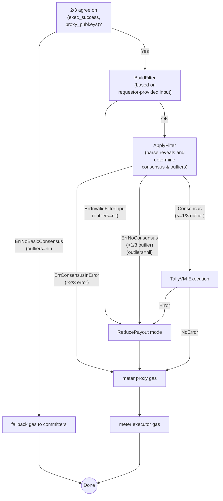

# Tally Module

## Overview
Primarily, the tally module aggregates the Oracle Program execution results reported by the Overlay Nodes, detects outliers, and calculates payouts.

## Tally Flow


At every block, the end blocker of the tally module queries the Core Contract for the list of data requests that are ready to be tallied. The tally process for a given data request involves the following sequence:
1. *Filtering*: The goal of filtering is to determine whether there is sufficient consensus among the reveals by the Overlay Nodes. The outcome of filter determines the future flow of tally operation on the data request. First, if there is less than 2/3 agreement on the success-or-fail of the execution and the data proxy public keys used during the execution, the outcome of tally is `ErrorNoBasicConsensus`. Otherwise, the module builds a filter based on the input provided by the data requestor. If there is an error while building a filter, the outcome of tally is `ErrorInvalidFilterInput`. Finally, if there is no error up to this point, the module applies the filter, whose outcome is `NoError` (= consensus), `ErrorConsensusInError` (more than 2/3 of reveals are failed executions or cannot be parsed), or `ErrorNoConsensus` (1/3 or more of reveals are deemed “outliers”). Note the definition of “outlier” depends on the type of filter:
    - None filter: No reveal is an outlier, even if it cannot be parsed.
    - Mode filter: A reveal is an outlier if its parsed value is not equal to the most frequent parsed reveal value.
    - MAD (Median Absolute Deviation) filter: A reveal is an outlier if it deviates from the median by more than `median_absolute_deviation * sigma_multiplier`. Note the sigma multiplier is a part of the filter input provided by the data requestor.
2. *Tally VM execution*: If the outcome of the filtering did not result in an error, the module executes the Tally Program specified in the data request.
3. *Gas calculation*: Since execution gas includes gas used by data proxies, the module first computes and consumes their gas consumption. If the filtering phase has failed to determine a list of data proxy public keys in consensus, the module skips this step and simply consumes the fallback gas for the committers. Otherwise, the amount of gas consumed by each data proxy `j` in the list in consensus per execution is
    
    $$
    \text{proxyGasUsed}_j = \frac{\text{proxyFee}}{\text{gasPrice}}
    $$
    
    Note the data proxy’s fee is retrieved from the data-proxy module and the gas price from the data request.
    
    The remaining part of the execution gas is due to the executors’ work. However, since the gas reports from the Overlay Nodes cannot be blindly trusted, the tally module calculates the “canonical” gas consumptions by the executors. Given `n` gas reports, they are first adjusted by the previously computed data proxy gas consumption and the remaining execution gas. The adjusted gas report `R_i` for executor `i` is
    
    $$
    R_i=\min \left( \left\lfloor\frac{\text{RemainingExecGas}}{\text{ReplicationFactor}}\right\rfloor,   \text{reportedGas}_i-\Sigma_j \text{proxyGasUsed}_j \right)
    $$
    
    The payout calculation based on the adjusted gas reports is split into two scenarios.
    
    - Gas reports from the Overlay Nodes are uniform: The gas used by executor `i` is simply the adjusted gas report `R_i`.
    
    $$
    \text{executorGasUsed}_i = R_0 = R_1 = ... = R_n
    $$

    - Gas reports from the Overlay Nodes are divergent: The module assigns a different gas consumption to the Overlay Node that has reported the lowest gas.
    
    $$
    \text{lowestReporter} = \left(\frac{\text{Low} \times 2}{\text{TotalShares}} \right)\times\text{TotalUsedGas}
    $$
        
    $$
    \text{nonLowestReporter} = \left(\frac{\text{Median}}{\text{TotalShares}} \right) \times \text{TotalUsedGas}
    $$
        
    
    where
    
    $$
    \text{Low}=\min(R_0,R_1,...,R_n)
    $$
    
    $$
    \text{Median}=\text{median}(R_0,R_1,...,R_n)
    $$
    
    $$
    \text{TotalUsedGas} = \text{Median} \times (\text{RF} - 1) + \min(\text{Low} * 2, \text{Median})
    $$
    
    $$
    \text{TotalShares} = \left(\text{Median} \times (\text{RF} - 1)\right) + (\text{Low} \times 2)
    $$
    
    The calculated execution gas consumption is returned in the tally result along with the tally gas consumption, which is the gas used by the tally module for filtering and tally VM execution. These gas calculations are converted into payout distribution messages, which are then delivered to the Core Contract for actual executions of funds transfers. Note the tally gas is burned, whereas the data proxy gas and executor gas are paid to the data proxies and executors, respectively. The table below describes the payout depending on the filter/tally outcome.

    ⬇️ Order of error detection
    ➡️ Order of payment (The burns are combined in one burn execution)

    | Outcome | Base Fee (burn) | Filter Fee (burn) | Tally VM Fee (burn) | Data Proxies Reward | Data Executors Reward |
    | --- | --- | --- | --- | --- | --- |
    | Timeout without reveal | ✅ | ❌ | ❌ (not executed) | ❌ | Fallback pay to committers |
    | `ErrNoBasicConsensus` | ✅ | ❌ | ❌ (not executed) | ❌ | Fallback pay to committers |
    | `ErrInvalidFilterInput` | ✅ | ❌ | ❌ (not executed) | ✅ | 80% pay (20% burn) |
    | `ErrNoConsensus` | ✅ | ✅ | ❌ (not executed) | ✅ | 80% pay (20% burn) |
    | `ErrConsensusInError` | ✅ | ✅ | ❌ (not executed) | ✅ | Full pay |
    | Tally execution error | ✅ | ✅ | ❌ (not executed) | ✅ | 80% pay (20% burn) |
    | No error | ✅ | ✅ | ✅ | ✅ | Full pay |

Once the filtering - tally VM execution - gas calculation sequence is completed, and the results are reported back to the Core Contract, data result entries are stored in the batching module under batch-ready status.

Note the tally module’s end blocker is structured so that most errors are caught and logged without causing the chain to halt. Only the most critical operations such as data result ID calculation or state writes can return an error.

## State
```
0x00 -> parameters
```


